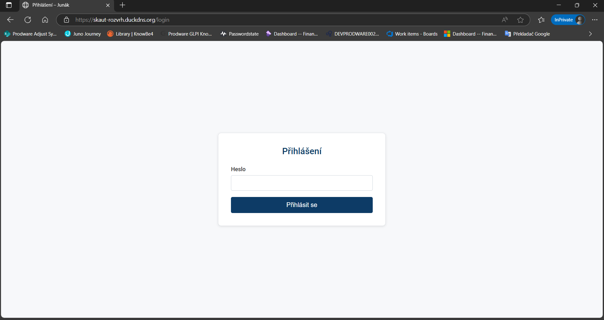
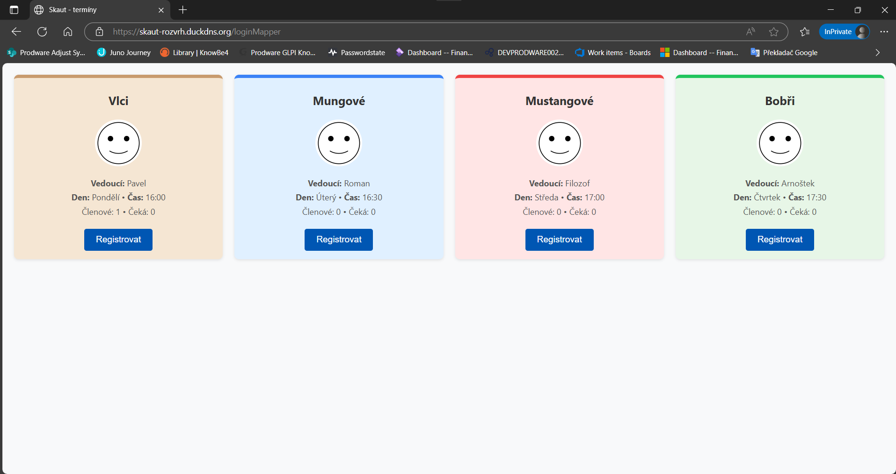
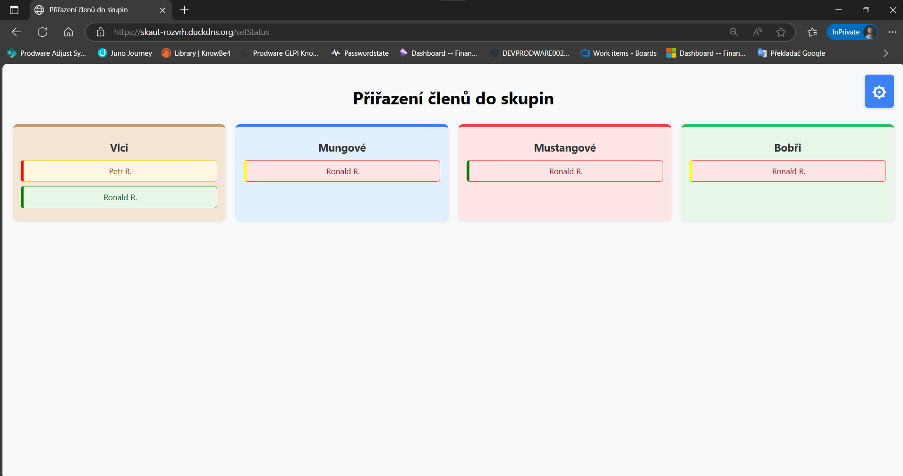
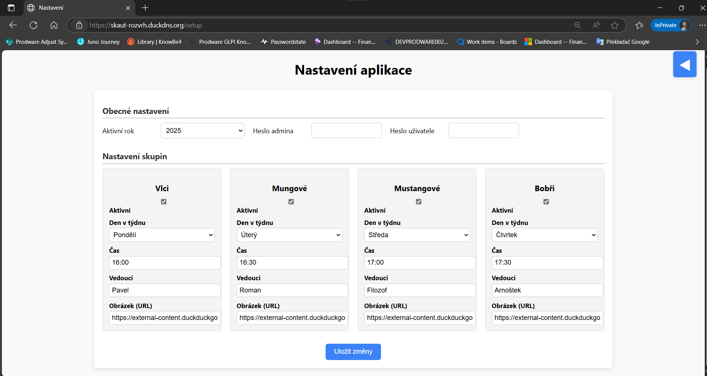

# SkautRegistrace

Web application for organizing member assignments into scout groups.

Provides a pleasant UI for parents and an admin panel for building the final assignments based on received requests.

---

## Features

- User-friendly interface for parents to submit assignment requests  
- Admin panel to review requests and create final scout group assignments  
- Backend powered by Java Spring Framework  
- PostgreSQL database for data storage  

---

## Installation

1. Clone the repository:

   ```bash
   git clone https://github.com/Electro-Lite/SkautRegistrace.git
   cd SkautRegistrace
   ```

2. Add your own `application.properties` file to the `src/main/resources` folder.  
   This file should contain your database connection and other configuration settings.

3. Build and run the application using Maven or your preferred IDE:

   ```bash
   ./mvnw spring-boot:run
   ```

   or run the main application class in your IDE.

---

## Database

Recomended to you have PostgreSQL installed and running. Configure the connection details in your `application.properties`.

---

## Usage

- Parents can access the web UI to submit their member assignment requests.  
- Admins use the admin panel to view requests and generate the final assignments.

---

## Screenshots

### Parent UI




### Admin Panel




## Important note
This application is *made for 4 or less groups!*

*Created by Electro-Lite*
